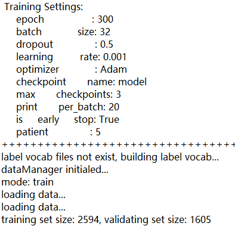
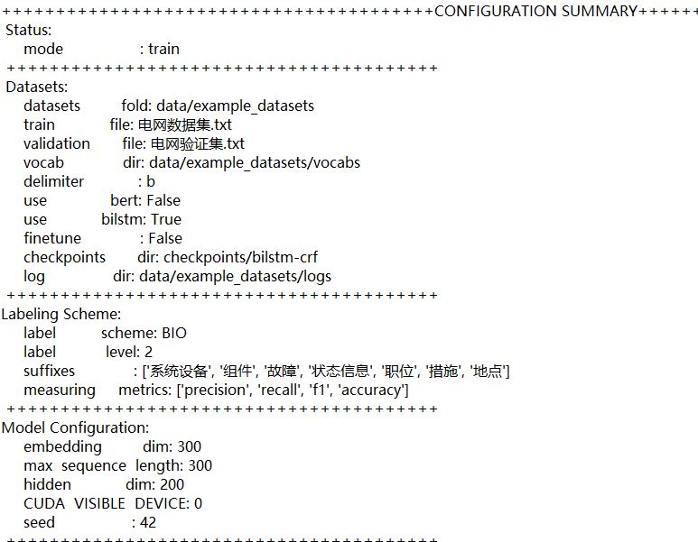
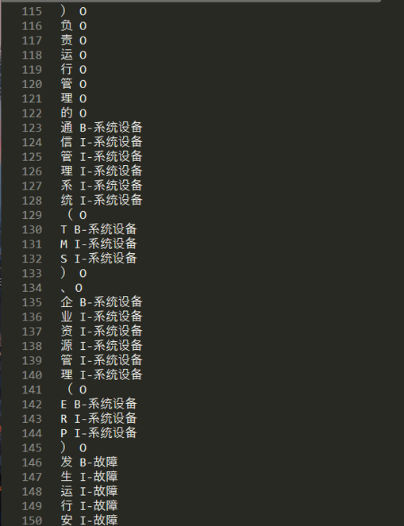
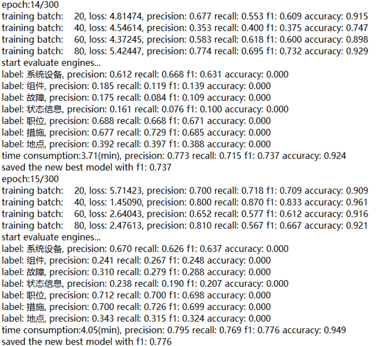
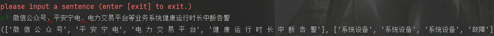

# 命名实体识别
此项目是基于Tensorflow 2.6.0的NER任务项目，支持BiLSTM-Crf、Bert-BiLSTM-Crf、Bert-Crf，可对Bert进行微调，提供可配置文档，配置完可直接运行。

## 环境
* python 3.9.7
* **CPU:** tensorflow==2.6.0
* **GPU:** tensorflow-gpu==2.6.0
* tensorflow-addons==0.14.0
* transformers==4.11.3
* jieba==0.42.1
* tqdm==4.62.3

推荐使用GPU加速训练，其他环境见requirements.txt

## 数据集
电网运维数据集    

## 使用
### 训练
将已经标注好的数据切割好训练、验证集放入data目录下，如果只提供训练集将会有程序自己按照9:1切割训练集与验证集。  
在system.config的Datasets(Input/Output)下配置好数据集的路径、分隔符、模型保存地址等。  
在system.config的Labeling Scheme配置标注模式。  
在system.config的Model Configuration/Training Settings下配置模型参数和训练参数。  

设定system.config的Status中的为train:
```
################ Status ################
mode=train
# string: train/interactive_predict
```

是否使用Bert做embedding(选择True/False):
```
use_bert=False
```

当使用Bert的时候是否对Bert进行微调(选择True/False):
```
finetune=False
```

这个项目支持Finetune-Bert+Crf、Finetune-Bert+BiLstm+Crf、Bert+BiLstm+Crf、BiLstm+Crf四类模型的训练，配置组合如下：  

模型|use_bert|use_bilstm|finetune|
:---|:---|:---|---
BiLstm+Crf|False|True|False
Bert+BiLstm+Crf|True|True|False
Finetune-Bert+Crf|True|False|True
Finetune-Bert+BiLstm+Crf|True|True|True

  
运行main.py开始训练。 
* 参数设置



* 模型配置



* 数据集



* 训练过程



* 实体识别结果



* Bilstm-CRF模型下效果

  

* Finetune-Bert-CRF模型下效果

  

* Bert-Blism-CRF模型下效果

  

***注(1):这里使用的transformers(https://github.com/huggingface/transformers) 包加载Bert，初次使用的时候会自动下载Bert的模型***  
***注(2):当重新训练的时候，Bert-Bilstm-CRF和Bilstm-CRF各自自动生成自己vocabs/label2id文件，不能混用，如果需要共用，你可以手动的定义标签***   
***注(3):使用Bert-Bilstm-CRF时候max_sequence_length不能超过512并且embedding_dim默认为768***

### 在线预测
仓库中已经训练好了Bilstm-CRF和Bert-Bilstm-CRF两个模型在同一份数据集上的参数，可直接进行试验，两者位于checkpoints/目录下  
* 使用Bilstm-CRF模型时使用bilstm-crf/里的system.config配置
* 使用Bert-Bilstm-CRF模型时使用bert-bilsm-crf/里的system.config配置   
将对应的配置替换掉当前的配置。  
最后，运行main.py开始在线预测。   
下图为在线预测结果，你可以移植到自己项目里面做成对外接口。    

 

##Reference：
* 参考项目：https://github.com/StanleyLsx/entity_extractor_by_ner
